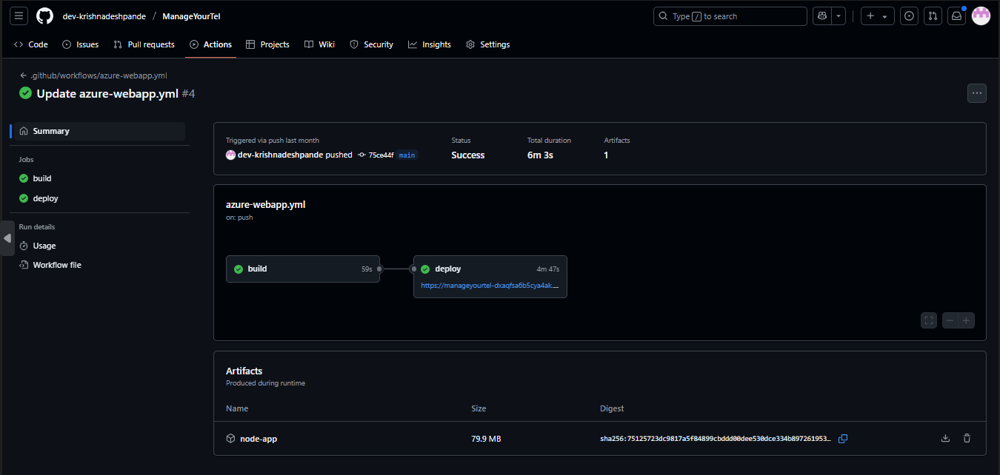
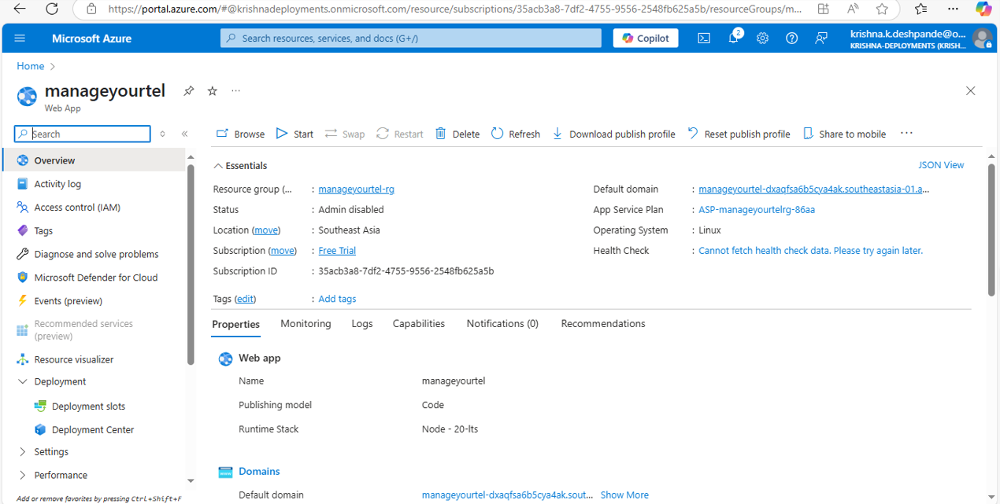

# ManageYourTel

It is a comprehensive hotel management solution that serves as a one-stop solution for managing your hotel operations. As the name suggests, ManageYourTel allows you to manage bookings across the online booking platforms in one place, create offline bookings, manage staff, and analyze booking statistics.

Functional Description
Booking Management: Manage bookings from various online booking platforms in a single interface. Create and manage offline bookings seamlessly.
Rooms Availability: Check the availability of rooms in real-time to ensure efficient room allocation and avoid overbooking.
Staff Management: Manage your hotel staff, including their schedules, roles, and responsibilities.
Statistics: Analyze booking statistics to gain insights into your hotel's performance, occupancy rates, and revenue.

Technologies Used
React: A JavaScript library for building user interfaces.
Material UI: A popular React UI framework for building responsive and accessible web applications.
React Query: A library for managing server state in React applications.
Supabase: An open-source Firebase alternative that provides a backend as a service.
Vite: A build tool that provides a faster and leaner development experience for modern web projects.

## 📜 Installation & Setup

Prerequisites

- Node.js (v14 or higher)
- npm (v6 or higher)

```sh
Installation

# Clone the repository:
git clone https://github.com/dev-krishnadeshpande/manageyourtel.git
cd manageyourtel

# Install the dependencies:
npm install

# Running the Project
# To start the development server, run:
npm run dev

# This will start the Vite development server and open the application in your default web browser.

# Building the Project
# To build the project for production, run:
npm run build

# This will create an optimized production build in the dist directory.
```

- Backend Setup
  The backend is set up using Supabase. You can find the Supabase configuration in the supabase.js file.

Deployments:

Implemented CI/CD pipelines using GitHub Actions and deployed on Azure Web App for streamlined and automated deployments.




